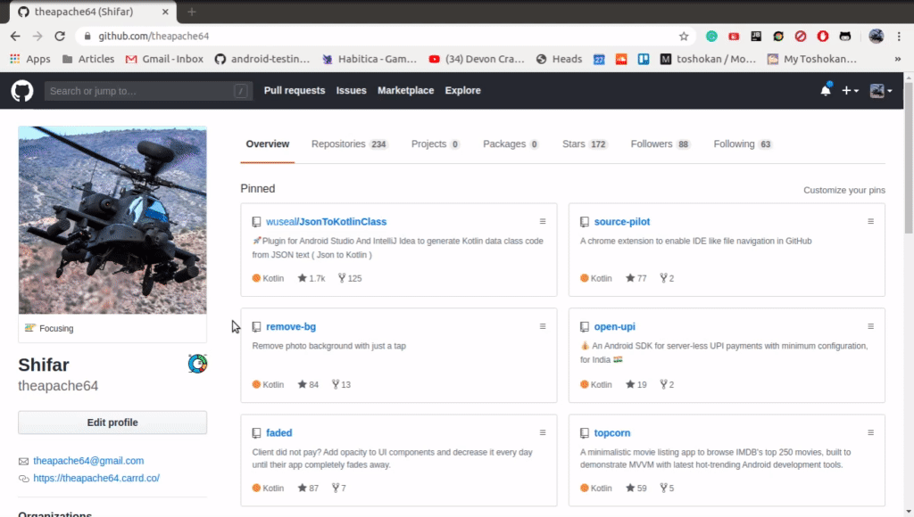
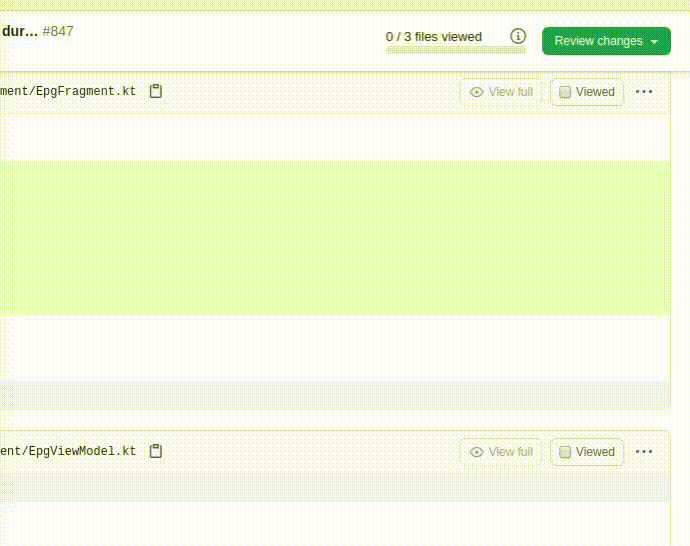
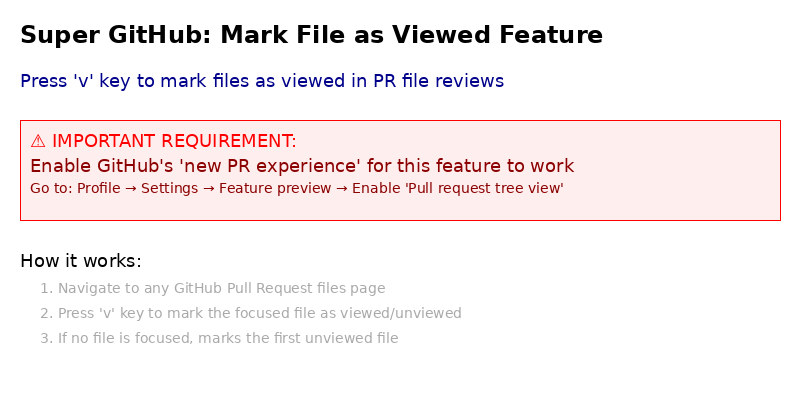

# :rocket: super-github

Enhance your GitHub experience


## Install

You can install Super GitHub in two ways:

### Option 1: Chrome Web Store (Coming Soon)
Open an issue, and I'll publish it in Chrome store 😉

### Option 2: Manual Installation from Releases
1. Go to the [Releases page](https://github.com/theapache64/super-github/releases)
2. Download the latest `super-github-vX.X.X.zip` file
3. Extract the ZIP file to a folder
4. Open Chrome and navigate to `chrome://extensions/`
5. Enable "Developer mode" in the top right
6. Click "Load unpacked" and select the extracted folder
7. The Super GitHub extension is now installed and active!

## :paintbrush: Features

### :baby_bottle: Repo Birth Date
Ever wondered when's your favorite repo born ?


The emoji specifies project started time.

If the time

- between 12AM and 5AM : 🌙
- between 5AM and 10AM : 🌞
- between 10AM and 3PM : ☀️
- between 3PM and 7PM : 🌥
- after 7PM :  🌓

### :bar_chart: Profile Summary



Click on the chart icon to view profile summary.


It also supports organizations too.


Thanks to [@tipsy](https://github.com/tipsy/profile-summary-for-github) for his hard work. :hugs:

### 👌 Auto Comment (PR Approval) 



Every time you click on the `Approve` radio button, your comment box will be filled with a random LGTM message.

### 🙏 Foldable Code

Helps you write foldable code blocks when you paste code/stacktrace into a comment body. 
Watch the demo  [here](https://twitter.com/theapache64/status/1365004116003446793)

### ⌨️ Mark File as Viewed



Press `v` key on PR file review pages to quickly mark files as "Viewed". The keyboard shortcut will:
- Mark the currently focused file as viewed/unviewed
- If no specific file is focused, mark the first unviewed file
- Work on any GitHub Pull Request files page

> **⚠️ Important:** This feature requires you to enable GitHub's **"new PR experience"**. To enable it, go to your GitHub profile → Settings → Feature preview → Enable "Pull request tree view".

## :ballot_box_with_check: TODO

- [x] Repo birth date
- [x] Profile summary
- [x] Random `LGTM` message for PR approval
- [x] Foldable code
- [x] Mark file as viewed with keyboard shortcut
- [ ] Do you have a feature in mind? Let's discuss it [here](https://github.com/theapache64/super-github/issues/new?labels=enhancement)

## :writing_hand: Author

- theapache64

## :gear: Development & Releases

### Creating a New Release

This project includes an automated release workflow. To create a new release:

1. Go to the [Actions tab](https://github.com/theapache64/super-github/actions)
2. Select "Create Chrome Extension Release" workflow
3. Click "Run workflow"
4. Enter the new version number (e.g., `1.0.5`)
5. Click "Run workflow"

The workflow will:
- Update version numbers in `build.gradle` and `manifest.json`
- Build the Chrome extension
- Create a ZIP package
- Commit the version changes
- Create a Git tag
- Create a GitHub release with the ZIP file attached

### Local Development

Requirements:
- Java 11 (for Gradle compatibility)
- Gradle (included via wrapper)

Build the extension locally:
```bash
./gradlew assemble
```

The built extension files will be in `build/distributions/`.